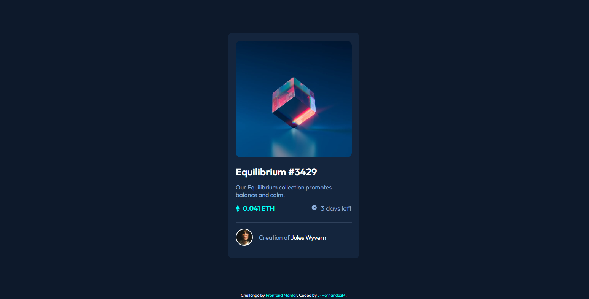

# Frontend Mentor - NFT preview card component solution

Esta es una solucion al reto [NFT preview card component challenge on Frontend Mentor](https://www.frontendmentor.io/challenges/nft-preview-card-component-SbdUL_w0U). 

## Tabla de contenidos

- [Descripcion](#descripcion)
  - [El desafio](#el-desafio)
  - [Screenshot](#screenshot)
  - [Links](#links)
- [Mi proceso](#mi-proceso)
  - [Hecho con](#hecho-con)
  - [Lo aprendido](#lo-que-aprendi)
- [Autor](#autor)

## Descripcion

Esta es mi propuesta de solucion al desafio de crear una NFT card usando unicamente HTML y CSS. En este caso aplique la metodologia Mobile First y de ahi escale a desktop.

## El desafio

El usuario deberia poder:

- Ver el layout optimo dependiendo de su tamano de pantalla.
- Ver la interaccion cuando se coloca el mouse encima de los elementos.

## Screenshot

## Links

- Solucion: [GITHUB](https://github.com/J-HernandezM/nft-preview-card)
- Live site: [PAGES](https://j-hernandezm.github.io/nft-preview-card/)

## Mi proceso

Despues de realizar el reto anterior el flujo de trabajo para realizar este reto fue bastante mas rapido y sin confusiones.
Me costo un poco lograr colocar el hover en la imagen principal pues no sabia como ocultar y mostrar la imagen, intente con mis conocimientos idear maneras pero no lo logre, finalmente encontre una propiedad llamada visibility y colocando correctamente los selectores en CSS logre realizarlo

## Hecho con

- Semantic HTML5 markup
- CSS custom properties
- Flexbox
- CSS Grid
- Mobile-first workflow

## Lo que aprendi

Aprendi a ocultar y mostrar un elemento en base a un hover usando unicamente CSS.

## Autor

- Website - [Portfolio en construccion](https://j-hernandezm.github.io)
- Frontend Mentor - [@J-HernandezM](https://www.frontendmentor.io/profile/J-HernandezM)
- Github - [@J-HernandezM](https://github.com/J-HernandezM)
- Twitter - [@__HernandezM](https://www.twitter.com/__HernandezM)

